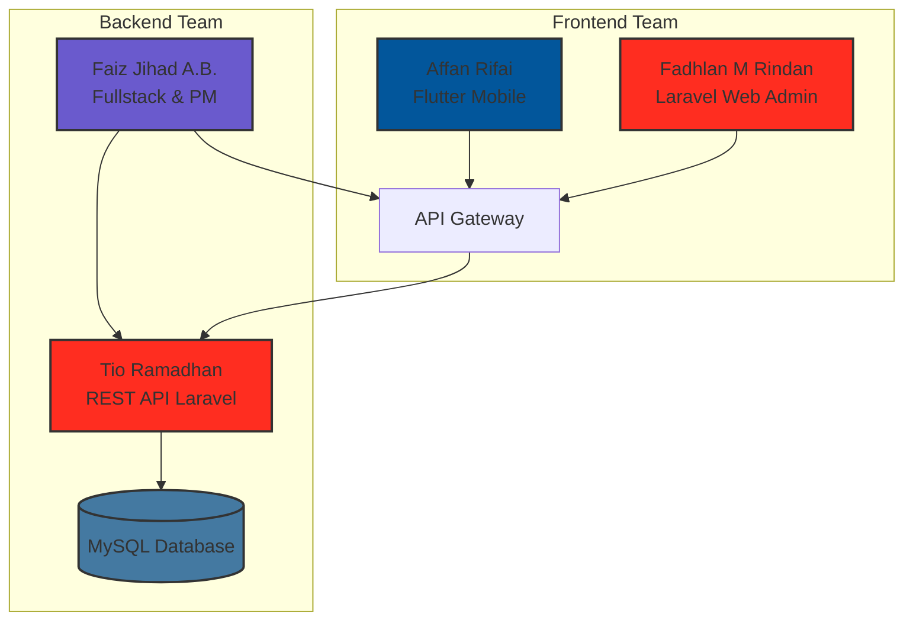
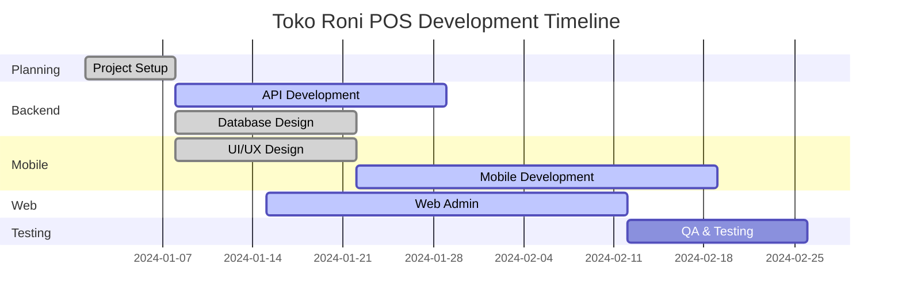

# 🛒 Toko Roni POS Mobile

<p align="center">
  
</p>

<p align="center">
  
  
  
  
</p>

<p align="center">
  
</p>

---

## 📱 **Tentang Aplikasi**

> **Aplikasi Point of Sale (POS) Mobile** yang modern dan powerful, dibangun dengan Flutter dan terintegrasi dengan Laravel REST API. Dirancang khusus untuk memudahkan proses transaksi, manajemen produk, dan monitoring stok secara real-time.

<div align="center">
  
  ### ⚡ **Web Admin** · **Mobile App** · **REST API**
  
</div>

---

## 👥 **Tim Pengembang**

<p align="center">
  <table>
    <tr>
      <td align="center" width="200">
        
        <br />
        <b>🎯 Affan Rifai</b>
        <br />
        <sub>Front End Mobile</sub>
        <br />
        <a href="https://github.com/AffanRifai">
          
        </a>
      </td>
      <td align="center" width="200">
        
        <br />
        <b>🚀 Faiz Jihad A.B.</b>
        <br />
        <sub>Fullstack & Project Manager</sub>
        <br />
        <a href="https://github.com/faizjihad">
          
        </a>
      </td>
    </tr>
    <tr>
      <td align="center" width="200">
        
        <br />
        <b>⚙️ Tio Ramadhan</b>
        <br />
        <sub>Backend Developer</sub>
        <br />
        <a href="https://github.com/tioramadhan">
          
        </a>
      </td>
      <td align="center" width="200">
        
        <br />
        <b>🎨 Fadhlan M Rindan</b>
        <br />
        <sub>Front End Web & QA</sub>
        <br />
        <a href="https://github.com/fadhlanrindan">
          
        </a>
      </td>
    </tr>
  </table>
</p>

---

## 🎯 **Pembagian Tugas**

| **Role** | **Nama** | **Tanggung Jawab** |
|----------|----------|-------------------|
| 🎯 **Front End Mobile** | Affan Rifai | - Pengembangan UI/UX mobile Flutter<br>- Integrasi API mobile<br>- State management<br>- Testing mobile |
| 🚀 **Fullstack & PM** | Faiz Jihad A.B. | - Manajemen proyek & timeline<br>- Koordinasi tim<br>- Fullstack development<br>- Code review & merging |
| ⚙️ **Backend Developer** | Tio Ramadhan | - Pengembangan REST API Laravel<br>- Database design & optimization<br>- Authentication & security<br>- Server management |
| 🎨 **Front End Web & QA** | Fadhlan M Rindan | - Pengembangan web admin (Laravel Blade)<br>- UI/UX web<br>- Quality assurance<br>- Testing & bug reporting |

---

## ✨ **Fitur Unggulan**

<p align="center">
  <table>
    <tr>
      <td align="center" width="200">
        
        <br />
        <b>🔐 Multi Login</b>
        <br />
        <sub>Password & Face Recognition</sub>
        <br />
        <sub>👤 Affan Rifai</sub>
      </td>
      <td align="center" width="200">
        
        <br />
        <b>📊 Dashboard</b>
        <br />
        <sub>Statistik Real-time</sub>
        <br />
        <sub>👤 Fadhlan & Affan</sub>
      </td>
      <td align="center" width="200">
        
        <br />
        <b>🛍️ Manajemen Produk</b>
        <br />
        <sub>CRUD & Kategori</sub>
        <br />
        <sub>👤 Tio & Affan</sub>
      </td>
    </tr>
    <tr>
      <td align="center">
        
        <br />
        <b>💳 Transaksi</b>
        <br />
        <sub>Keranjang & Riwayat</sub>
        <br />
        <sub>👤 Faiz & Affan</sub>
      </td>
      <td align="center">
        
        <br />
        <b>📦 Inventory</b>
        <br />
        <sub>Stok & Kadaluarsa</sub>
        <br />
        <sub>👤 Tio & Fadhlan</sub>
      </td>
      <td align="center">
        
        <br />
        <b>🔔 Notifikasi</b>
        <br />
        <sub>Stok Rendah</sub>
        <br />
        <sub>👤 Faiz & Tio</sub>
      </td>
    </tr>
  </table>
</p>

---

## 🏗️ **Arsitektur Sistem**



---

## 📂 **Struktur Project**

```bash
📦 Toko-Roni-Mobile-App
 ┣ 📂 lib
 ┃ ┣ 📂 models          # 📊 Data models
 ┃ ┃ ┣ 📜 product_model.dart
 ┃ ┃ ┣ 📜 category_model.dart
 ┃ ┃ ┗ 📜 transaction_model.dart
 ┃ ┣ 📂 services         # 🔌 API Services
 ┃ ┃ ┣ 📜 api_service.dart
 ┃ ┃ ┣ 📜 auth_service.dart
 ┃ ┃ ┗ 📜 product_service.dart
 ┃ ┣ 📂 screens          # 📱 UI Screens
 ┃ ┃ ┣ 📂 login
 ┃ ┃ ┣ 📂 dashboard
 ┃ ┃ ┣ 📂 product
 ┃ ┃ ┗ 📂 transaction
 ┃ ┣ 📂 widgets          # 🧩 Reusable widgets
 ┃ ┗ 📜 main.dart        # 🚀 Entry point
 ┣ 📂 assets             # 🖼️ Images & fonts
 ┣ 📜 pubspec.yaml       # 📦 Dependencies
 ┗ 📜 README.md          # 📖 Documentation
```

---

## 🚀 **Quick Start**

### 📋 **Prerequisites**
- Flutter SDK (>=3.16.0)
- Dart SDK (>=3.2.0)
- Android Studio / VS Code
- Git

### ⚙️ **Instalasi**

```bash
# Clone repository
git clone https://github.com/AffanRifai/Toko-Roni-Mobile-App.git

# Masuk ke direktori
cd Toko-Roni-Mobile-App

# Install dependencies
flutter pub get

# Jalankan aplikasi
flutter run

# Build APK release
flutter build apk --release
```

---

## 🔌 **API Configuration**

<p align="center">
  
</p>

```dart
// lib/services/api_service.dart
class ApiService {
  static const String baseUrl = 'http://localhost:8000/api';
  static const String login = '$baseUrl/login';
  static const String products = '$baseUrl/products';
  static const String categories = '$baseUrl/categories';
  static const String transactions = '$baseUrl/transactions';
  static const String dashboard = '$baseUrl/dashboard';
}
```

### 📡 **Endpoint API**

| Method | Endpoint | Deskripsi | Developer |
|--------|----------|-----------|-----------|
| `POST` | `/api/login` | Autentikasi user | 👤 Tio |
| `GET` | `/api/products` | Daftar produk | 👤 Tio |
| `GET` | `/api/categories` | Daftar kategori | 👤 Tio |
| `POST` | `/api/transactions` | Buat transaksi | 👤 Faiz |
| `GET` | `/api/dashboard` | Data dashboard | 👤 Faiz |

---

## 📊 **Development Progress**

<p align="center">
  
</p>

### 🎯 **Affan Rifai - Front End Mobile** (80%)
- [x] Setup Flutter project
- [x] Login screen UI
- [x] Dashboard layout
- [x] Product listing
- [x] Product detail
- [ ] Transaction screen
- [ ] Cart system
- [ ] Face recognition

### 🚀 **Faiz Jihad - Fullstack & PM** (70%)
- [x] Project planning
- [x] Sprint management
- [x] API documentation
- [x] Database schema
- [ ] Transaction API
- [ ] Code review
- [ ] Deployment

### ⚙️ **Tio Ramadhan - Backend** (75%)
- [x] Laravel setup
- [x] Authentication API
- [x] Product API
- [x] Category API
- [x] Database optimization
- [ ] Inventory API
- [ ] Report API

### 🎨 **Fadhlan M Rindan - Web & QA** (60%)
- [x] Web admin layout
- [x] Login page
- [x] Dashboard web
- [ ] Product management
- [ ] Testing scenarios
- [ ] Bug reporting
- [ ] QA documentation

---

## 📈 **Project Timeline**



---

## 🛠️ **Tech Stack**

<p align="center">
  
</p>

| **Bidang** | **Teknologi** | **Developer** |
|------------|--------------|---------------|
| 📱 Mobile | Flutter, Dart, Provider | Affan Rifai |
| 🌐 Web | Laravel, Blade, Bootstrap | Fadhlan M Rindan |
| 🔧 Backend | Laravel, Sanctum, MySQL | Tio Ramadhan |
| 📊 Database | MySQL, Laravel Eloquent | Tio Ramadhan |
| 🎯 Management | Git, GitHub, Trello | Faiz Jihad A.B. |
| 🧪 Testing | Postman, PHPUnit | Fadhlan M Rindan |

---

## 🤝 **Cara Kolaborasi**

### Branch Strategy
```bash
main
├── develop
│   ├── feature/mobile/*      # Affan Rifai
│   ├── feature/web/*          # Fadhlan M Rindan
│   ├── feature/api/*          # Tio Ramadhan
│   └── feature/integration/*  # Faiz Jihad A.B.
```

### Git Workflow
```bash
# 1. Pull latest changes
git checkout develop
git pull origin develop

# 2. Create feature branch
git checkout -b feature/mobile/login

# 3. Commit changes
git add .
git commit -m "Add login screen UI"

# 4. Push and create PR
git push origin feature/mobile/login
# Create Pull Request to develop branch
```

---

## 🐛 **Issue Tracking**

| **Priority** | **Issue** | **Assignee** | **Status** |
|--------------|-----------|--------------|------------|
| 🔴 High | Face recognition integration | @AffanRifai | In Progress |
| 🟡 Medium | Transaction API optimization | @tioramadhan | Review |
| 🟢 Low | UI responsive improvements | @fadhlanrindan | Todo |
| 🔴 High | Database indexing | @faizjihad | Done |

---

## 📝 **Meeting Schedule**

- **Daily Standup**: 09:00 WIB (15 menit)
- **Sprint Planning**: Setiap Senin (1 jam)
- **Sprint Review**: Setiap Jumat (1 jam)
- **Retrospective**: Setiap 2 minggu

---

## 📄 **License**

<p align="center">
  
</p>

```
MIT License

Copyright (c) 2024 Tim Pengembang Toko Roni POS

Dibuat dengan ❤️ oleh:
- Affan Rifai
- Faiz Jihad Al Baihaqi
- Tio Ramadhan
- Fadhlan M Rindan

Permission is hereby granted, free of charge, to any person obtaining a copy
of this software and associated documentation files...
```

---

## 🌟 **Kontributor**

<p align="center">
  <a href="https://github.com/AffanRifai">
    
  </a>
  <a href="https://github.com/faizjihad">
    
  </a>
  <a href="https://github.com/tioramadhan">
    
  </a>
  <a href="https://github.com/fadhlanrindan">
    
  </a>
</p>

<p align="center">
  
</p>

<p align="center">
  <b>🚀 Tim Pengembang Toko Roni POS</b>
  <br />
  <sub>Affan Rifai · Faiz Jihad · Tio Ramadhan · Fadhlan M Rindan</sub>
  <br />
  <br />
  
  <br />
  © 2024 Toko Roni POS System
</p>
