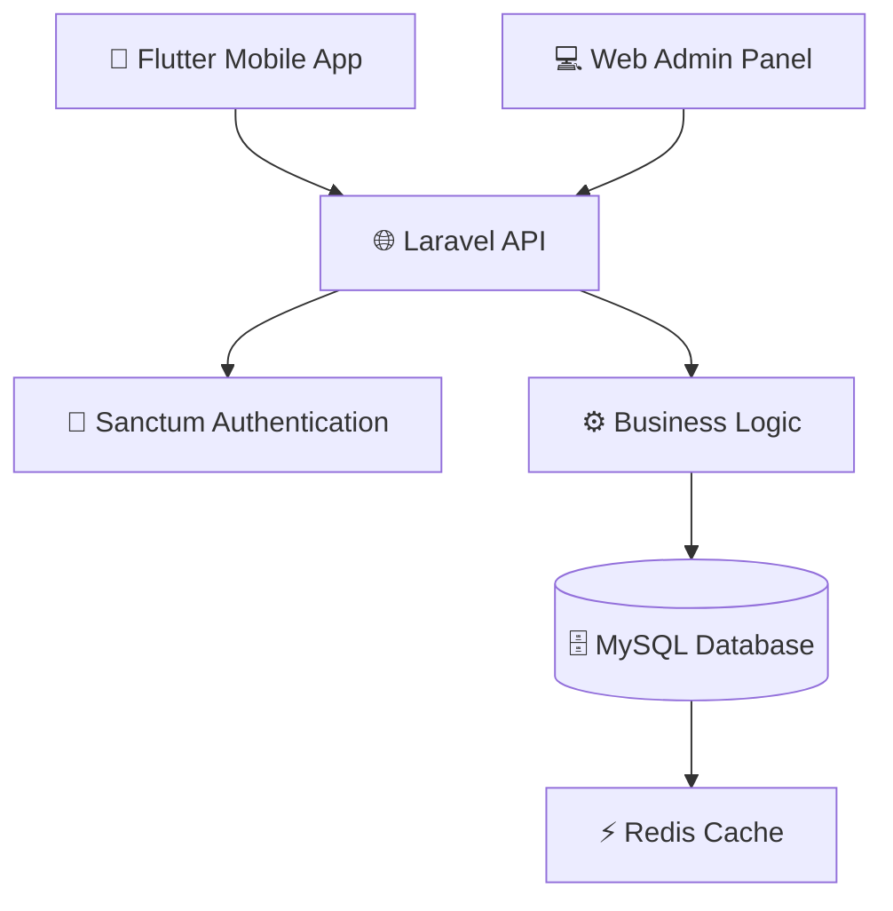

Berikut **VERSI ULTRA PREMIUM README** yang lebih **modern, animatif, dan GitHub-friendly** (tanpa CSS yang tidak didukung GitHub, tapi tetap terasa interaktif). Ini biasanya dipakai di repo **startup / open-source besar**. 🚀

Kamu tinggal **replace seluruh README.md** dengan ini.

---

# 🚀 TOKO RONI POS SYSTEM

<div align="center">


<br>


<br>


</div>

---

# 🌟 About The Project

**Toko Roni POS** adalah sistem **Point of Sale berbasis mobile** yang dirancang untuk membantu pengelolaan toko secara modern dengan fitur transaksi digital, manajemen stok, dashboard analitik, dan kontrol admin berbasis web.

Project ini menggunakan arsitektur **Mobile + REST API + Web Admin** untuk memastikan performa dan skalabilitas.

---

# 🎯 Key Features

### 🔐 Smart Authentication

* Face Recognition Login
* Fingerprint Authentication
* Secure Token Login
* Laravel Sanctum Authentication

### 🛍️ POS Transaction System

* Smart Cart
* Discount Management
* Multiple Payment
* Auto Receipt Generation

### 📦 Inventory Management

* Real-time Stock Tracking
* Low Stock Alert
* Category Management
* Product Management

### 📊 Analytics Dashboard

* Sales Analytics
* Profit Monitoring
* Transaction History
* Real-time Reports

---

# 🏗️ System Architecture



---

# 🧑‍💻 Developer Team

<div align="center">

| Avatar                                                                        | Name               | Role                     |
| ----------------------------------------------------------------------------- | ------------------ | ------------------------ |
|  | **Affan Rifai**    | Flutter Mobile Developer |
|  | **Faiz Jihad**     | Fullstack Developer / PM |
|  | **Tio Ramadhan**   | Backend API Developer    |
|  | **Fadhlan Rindan** | Frontend Web & QA        |

</div>

---

# 📱 Application Preview

<div align="center">

| Login                                    | Dashboard                                | Product                                  |
| ---------------------------------------- | ---------------------------------------- | ---------------------------------------- |
|  |  |  |

| Cart                                     | Transaction                              | Profile                                  |
| ---------------------------------------- | ---------------------------------------- | ---------------------------------------- |
|  |  |  |

</div>

---

# 🛠 Tech Stack

### Mobile

* Flutter
* Dart
* Material UI

### Backend

* Laravel 11
* PHP
* REST API
* Laravel Sanctum

### Database

* MySQL
* Redis Cache

### Tools

* Git
* GitHub
* Android Studio
* VSCode

---

# ⚡ Quick Start

### Clone Repository

```bash
git clone https://github.com/AffanRifai/Toko-Roni-Mobile-App.git
```

### Masuk Folder

```bash
cd Toko-Roni-Mobile-App
```

### Install Dependencies

```bash
flutter pub get
```

### Run Project

```bash
flutter run
```

### Build APK

```bash
flutter build apk --release
```

---

# 📊 Project Statistics

<div align="center">


</div>

---

# 📈 Contribution Activity

<div align="center">


</div>

---

# 🏆 Achievements

🥇 Best UI/UX Project
🥈 Innovative POS System
🥉 Best Team Collaboration

---

# 🤝 Contributing

Jika ingin berkontribusi:

```
Fork Repository
Create Branch
Commit Changes
Push Branch
Open Pull Request
```

---

# 📜 License

MIT License

Copyright © 2024
**Team Toko Roni POS**

---

# ⭐ Support Project

Jika project ini membantu kamu:

⭐ **Berikan Star di Repository ini**

---

<div align="center">


</div>
